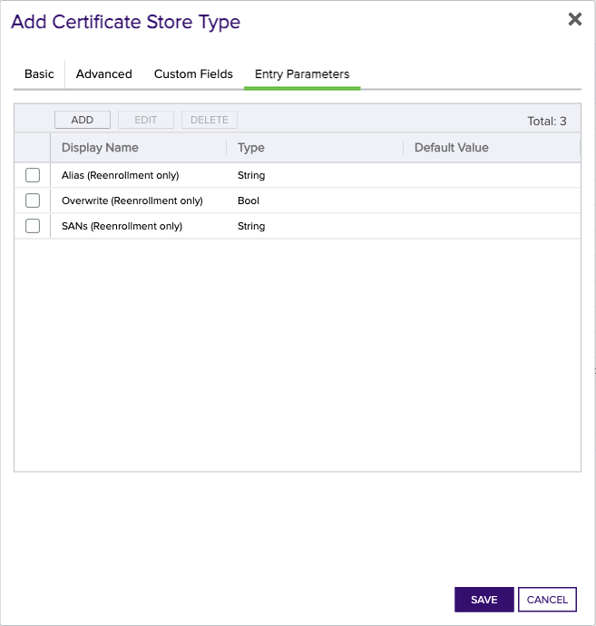

<h1 align="center" style="border-bottom: none">
    F5 BigIQ Universal Orchestrator Extension
</h1>

<p align="center">
  <!-- Badges -->

<a href="https://github.com/Keyfactor/f5-bigiq-rest-orchestrator/releases"></a>


</p>

<p align="center">
  <!-- TOC -->
  <a href="#support">
    <b>Support</b>
  </a>
  ·
  <a href="#installation">
    <b>Installation</b>
  </a>
  ·
  <a href="#license">
    <b>License</b>
  </a>
  ·
  <a href="https://github.com/orgs/Keyfactor/repositories?q=orchestrator">
    <b>Related Integrations</b>
  </a>
</p>

## Overview

The F5 Big IQ Orchestrator Extension supports the following use cases:

- Inventories an existing F5 Big IQ device to import SSL certificates into Keyfactor Command for management
- Add an existing or newly enrolled certificate and private key to an existing F5 Big IQ device not already on that device.
- Remove a certificate and private key from an existing F5 Big IQ device.
- Add an existing or newly enrolled certificate and private key to an existing F5 Big IQ device already on that device.  Optionally (based on the DeployCertificateOnRenewal setting on the certificate store), the newly renewed/replaced certificate will be deployed to any linked F5 Big IP device.
- Reenrollment (On Device Key Generation) of a new or existing certificate on the F5 Big IQ device.  In this use case, the key pair and CSR will be created on the F5 Big IQ device, Keyfactor Command will enroll the certificate, and the certificate will then be installed on the device.  If the DeployCertificateOnRenewal option is set, the certificate will be deployed to any linked F5 Big IP devices.

Use cases NOT supported by the F5 Big IQ Orchestrator Extension:

- Creating new binding relationships between F5 Big IQ and any linked F5 Big IP devices.
- Storing binding relationships in Keyfactor Command during Inventory.


## Compatibility

This integration is compatible with Keyfactor Universal Orchestrator version 10.4 and later.

## Support
The F5 BigIQ Universal Orchestrator extension is supported by Keyfactor for Keyfactor customers. If you have a support issue, please open a support ticket with your Keyfactor representative. If you have a support issue, please open a support ticket via the Keyfactor Support Portal at https://support.keyfactor.com. 
 
> To report a problem or suggest a new feature, use the **[Issues](../../issues)** tab. If you want to contribute actual bug fixes or proposed enhancements, use the **[Pull requests](../../pulls)** tab.

## Requirements & Prerequisites

Before installing the F5 BigIQ Universal Orchestrator extension, we recommend that you install [kfutil](https://github.com/Keyfactor/kfutil). Kfutil is a command-line tool that simplifies the process of creating store types, installing extensions, and instantiating certificate stores in Keyfactor Command.


When creating a Keyfactor Command Certificate Store, you will be asked to enter server credentials.  These credentials will serve two purposes:
1. They will be used to authenticate to the F5 Big IQ instance when accessing API endpoints.  Please make sure these credentials have Admin authority on F5 Big IQ.
2. When Inventorying and Adding/Replacing certificates it will be necessary for certificate files to be transferred to and from the F5 device. The F5 Big IQ Orchestrator Extension uses SCP (Secure Copy Protocol) to perform these functions. Please make sure your F5 Big IQ device is set up to allow SCP to transfer files *to* /var/config/rest/downloads (a reserved F5 Big IQ folder used for file transfers) and *from* /var/config/rest/fileobject (the certificate file location path) and all subfolders. Other configuration tasks may be necessary in your environment to enable this feature.


## Create the F5-BigIQ Certificate Store Type

To use the F5 BigIQ Universal Orchestrator extension, you **must** create the F5-BigIQ Certificate Store Type. This only needs to happen _once_ per Keyfactor Command instance.


* **Create F5-BigIQ using kfutil**:

    ```shell
    # F5 Big IQ
    kfutil store-types create F5-BigIQ
    ```

* **Create F5-BigIQ manually in the Command UI**:
    <details><summary>Create F5-BigIQ manually in the Command UI</summary>

    Create a store type called `F5-BigIQ` with the attributes in the tables below:

    #### Basic Tab
    | Attribute | Value | Description |
    | --------- | ----- | ----- |
    | Name | F5 Big IQ | Display name for the store type (may be customized) |
    | Short Name | F5-BigIQ | Short display name for the store type |
    | Capability | F5-BigIQ | Store type name orchestrator will register with. Check the box to allow entry of value |
    | Supports Add | ✅ Checked | Check the box. Indicates that the Store Type supports Management Add |
    | Supports Remove | ✅ Checked | Check the box. Indicates that the Store Type supports Management Remove |
    | Supports Discovery | 🔲 Unchecked |  Indicates that the Store Type supports Discovery |
    | Supports Reenrollment | ✅ Checked |  Indicates that the Store Type supports Reenrollment |
    | Supports Create | 🔲 Unchecked |  Indicates that the Store Type supports store creation |
    | Needs Server | ✅ Checked | Determines if a target server name is required when creating store |
    | Blueprint Allowed | ✅ Checked | Determines if store type may be included in an Orchestrator blueprint |
    | Uses PowerShell | 🔲 Unchecked | Determines if underlying implementation is PowerShell |
    | Requires Store Password | 🔲 Unchecked | Enables users to optionally specify a store password when defining a Certificate Store. |
    | Supports Entry Password | 🔲 Unchecked | Determines if an individual entry within a store can have a password. |

    The Basic tab should look like this:

    

    #### Advanced Tab
    | Attribute | Value | Description |
    | --------- | ----- | ----- |
    | Supports Custom Alias | Required | Determines if an individual entry within a store can have a custom Alias. |
    | Private Key Handling | Required | This determines if Keyfactor can send the private key associated with a certificate to the store. Required because IIS certificates without private keys would be invalid. |
    | PFX Password Style | Default | 'Default' - PFX password is randomly generated, 'Custom' - PFX password may be specified when the enrollment job is created (Requires the Allow Custom Password application setting to be enabled.) |

    The Advanced tab should look like this:

    

    #### Custom Fields Tab
    Custom fields operate at the certificate store level and are used to control how the orchestrator connects to the remote target server containing the certificate store to be managed. The following custom fields should be added to the store type:

    | Name | Display Name | Description | Type | Default Value/Options | Required |
    | ---- | ------------ | ---- | --------------------- | -------- | ----------- |
    | DeployCertificateOnRenewal | Deploy Certificate to Linked Big IP on Renewal | This optional setting determines whether renewed certificates (Management-Add jobs with Overwrite selected) will be deployed to all linked Big IP devices. Linked devices are determined by looking at all of the client-ssl profiles that reference the renewed certificate that have an associated virtual server linked to a Big IP device. An immediate deployment is then scheduled within F5 Big IQ for each linked Big IP device. | Bool | false | 🔲 Unchecked |
    | IgnoreSSLWarning | Ignore SSL Warning | If you use a self signed certificate for the F5 Big IQ portal, you will need to add this optional Custom Field and set the value to True on the managed certificate store. | Bool | false | 🔲 Unchecked |
    | UseTokenAuth | Use Token Authentication | If you prefer to use F5 Big IQ's Token Authentication to authenticate F5 Big IQ API calls, you will need to add this optional Custom Field and set the value to True on the managed certificate store. If set to True for the store, the userid/password credentials you set for the certificate store will be used once to receive a token. This token is then used for all subsequent API calls for the duration of the job. If this option does not exist or is set to False, the userid/password credentials you set for the certificate store will be used for all API calls. | Bool | false | 🔲 Unchecked |
    | LoginProviderName | Authentication Provider Name | If Use Token Authentication is selected, you may optionally add a value for the authentication provider F5 Big IQ will use to retrieve the auth token. If you choose not to add this field or leave it blank on the certificate store (with no default value set), the default of "TMOS" will be used. | String |  | 🔲 Unchecked |
    | ServerUsername | Server Username | Login credential for the F5 Big IQ device.  MUST be an Admin account. | Secret |  | 🔲 Unchecked |
    | ServerPassword | Server Password | Login password for the F5 Big IQ device. | Secret |  | 🔲 Unchecked |

    The Custom Fields tab should look like this:

    


    #### Entry Parameters Tab

    | Name | Display Name | Description | Type | Default Value | Entry has a private key | Adding an entry | Removing an entry | Reenrolling an entry |
    | ---- | ------------ | ---- | ------------- | ----------------------- | ---------------- | ----------------- | ------------------- | ----------- |
    | Alias | Alias (Reenrollment only) | The name F5 Big IQ uses to identify the certificate | String |  | 🔲 Unchecked | 🔲 Unchecked | 🔲 Unchecked | ✅ Checked |
    | Overwrite | Overwrite (Reenrollment only) | Allow overwriting an existing certificate when reenrolling? | Bool | False | 🔲 Unchecked | 🔲 Unchecked | 🔲 Unchecked | ✅ Checked |
    | SANs | SANs (Reenrollment only) | External SANs for the requested certificate. Each SAN must be prefixed with the type (DNS: or IP:) and multiple SANs must be delimitted by an ampersand (&). Example: DNS:server.domain.com&IP:127.0.0.1&DNS:server2.domain.com.  This is an optional field. | String |  | 🔲 Unchecked | 🔲 Unchecked | 🔲 Unchecked | 🔲 Unchecked |

    The Entry Parameters tab should look like this:

    


    </details>

## Installation

1. **Download the latest F5 BigIQ Universal Orchestrator extension from GitHub.** 

    Navigate to the [F5 BigIQ Universal Orchestrator extension GitHub version page](https://github.com/Keyfactor/f5-bigiq-rest-orchestrator/releases/latest). Refer to the compatibility matrix below to determine whether the `net6.0` or `net8.0` asset should be downloaded. Then, click the corresponding asset to download the zip archive.
    | Universal Orchestrator Version | Latest .NET version installed on the Universal Orchestrator server | `rollForward` condition in `Orchestrator.runtimeconfig.json` | `f5-bigiq-rest-orchestrator` .NET version to download |
    | --------- | ----------- | ----------- | ----------- |
    | Older than `11.0.0` | | | `net6.0` |
    | Between `11.0.0` and `11.5.1` (inclusive) | `net6.0` | | `net6.0` | 
    | Between `11.0.0` and `11.5.1` (inclusive) | `net8.0` | `Disable` | `net6.0` | 
    | Between `11.0.0` and `11.5.1` (inclusive) | `net8.0` | `LatestMajor` | `net8.0` | 
    | `11.6` _and_ newer | `net8.0` | | `net8.0` |

    Unzip the archive containing extension assemblies to a known location.

    > **Note** If you don't see an asset with a corresponding .NET version, you should always assume that it was compiled for `net6.0`.

2. **Locate the Universal Orchestrator extensions directory.**

    * **Default on Windows** - `C:\Program Files\Keyfactor\Keyfactor Orchestrator\extensions`
    * **Default on Linux** - `/opt/keyfactor/orchestrator/extensions`
    
3. **Create a new directory for the F5 BigIQ Universal Orchestrator extension inside the extensions directory.**
        
    Create a new directory called `f5-bigiq-rest-orchestrator`.
    > The directory name does not need to match any names used elsewhere; it just has to be unique within the extensions directory.

4. **Copy the contents of the downloaded and unzipped assemblies from __step 2__ to the `f5-bigiq-rest-orchestrator` directory.**

5. **Restart the Universal Orchestrator service.**

    Refer to [Starting/Restarting the Universal Orchestrator service](https://software.keyfactor.com/Core-OnPrem/Current/Content/InstallingAgents/NetCoreOrchestrator/StarttheService.htm).


6. **(optional) PAM Integration** 

    The F5 BigIQ Universal Orchestrator extension is compatible with all supported Keyfactor PAM extensions to resolve PAM-eligible secrets. PAM extensions running on Universal Orchestrators enable secure retrieval of secrets from a connected PAM provider.

    To configure a PAM provider, [reference the Keyfactor Integration Catalog](https://keyfactor.github.io/integrations-catalog/content/pam) to select an extension, and follow the associated instructions to install it on the Universal Orchestrator (remote).


> The above installation steps can be supplimented by the [official Command documentation](https://software.keyfactor.com/Core-OnPrem/Current/Content/InstallingAgents/NetCoreOrchestrator/CustomExtensions.htm?Highlight=extensions).


## Defining Certificate Stores


* **Manually with the Command UI**

    <details><summary>Create Certificate Stores manually in the UI</summary>

    1. **Navigate to the _Certificate Stores_ page in Keyfactor Command.**

        Log into Keyfactor Command, toggle the _Locations_ dropdown, and click _Certificate Stores_.

    2. **Add a Certificate Store.**

        Click the Add button to add a new Certificate Store. Use the table below to populate the **Attributes** in the **Add** form.
        | Attribute | Description |
        | --------- | ----------- |
        | Category | Select "F5 Big IQ" or the customized certificate store name from the previous step. |
        | Container | Optional container to associate certificate store with. |
        | Client Machine |  |
        | Store Path |  |
        | Orchestrator | Select an approved orchestrator capable of managing `F5-BigIQ` certificates. Specifically, one with the `F5-BigIQ` capability. |
        | DeployCertificateOnRenewal | This optional setting determines whether renewed certificates (Management-Add jobs with Overwrite selected) will be deployed to all linked Big IP devices. Linked devices are determined by looking at all of the client-ssl profiles that reference the renewed certificate that have an associated virtual server linked to a Big IP device. An immediate deployment is then scheduled within F5 Big IQ for each linked Big IP device. |
        | IgnoreSSLWarning | If you use a self signed certificate for the F5 Big IQ portal, you will need to add this optional Custom Field and set the value to True on the managed certificate store. |
        | UseTokenAuth | If you prefer to use F5 Big IQ's Token Authentication to authenticate F5 Big IQ API calls, you will need to add this optional Custom Field and set the value to True on the managed certificate store. If set to True for the store, the userid/password credentials you set for the certificate store will be used once to receive a token. This token is then used for all subsequent API calls for the duration of the job. If this option does not exist or is set to False, the userid/password credentials you set for the certificate store will be used for all API calls. |
        | LoginProviderName | If Use Token Authentication is selected, you may optionally add a value for the authentication provider F5 Big IQ will use to retrieve the auth token. If you choose not to add this field or leave it blank on the certificate store (with no default value set), the default of "TMOS" will be used. |
        | ServerUsername | Login credential for the F5 Big IQ device.  MUST be an Admin account. |
        | ServerPassword | Login password for the F5 Big IQ device. |


        

        <details><summary>Attributes eligible for retrieval by a PAM Provider on the Universal Orchestrator</summary>

        If a PAM provider was installed _on the Universal Orchestrator_ in the [Installation](#Installation) section, the following parameters can be configured for retrieval _on the Universal Orchestrator_.
        | Attribute | Description |
        | --------- | ----------- |
        | ServerUsername | Login credential for the F5 Big IQ device.  MUST be an Admin account. |
        | ServerPassword | Login password for the F5 Big IQ device. |


        Please refer to the **Universal Orchestrator (remote)** usage section ([PAM providers on the Keyfactor Integration Catalog](https://keyfactor.github.io/integrations-catalog/content/pam)) for your selected PAM provider for instructions on how to load attributes orchestrator-side.

        > Any secret can be rendered by a PAM provider _installed on the Keyfactor Command server_. The above parameters are specific to attributes that can be fetched by an installed PAM provider running on the Universal Orchestrator server itself. 
        </details>
        

    </details>

* **Using kfutil**
    
    <details><summary>Create Certificate Stores with kfutil</summary>
    
    1. **Generate a CSV template for the F5-BigIQ certificate store**

        ```shell
        kfutil stores import generate-template --store-type-name F5-BigIQ --outpath F5-BigIQ.csv
        ```
    2. **Populate the generated CSV file**

        Open the CSV file, and reference the table below to populate parameters for each **Attribute**.
        | Attribute | Description |
        | --------- | ----------- |
        | Category | Select "F5 Big IQ" or the customized certificate store name from the previous step. |
        | Container | Optional container to associate certificate store with. |
        | Client Machine |  |
        | Store Path |  |
        | Orchestrator | Select an approved orchestrator capable of managing `F5-BigIQ` certificates. Specifically, one with the `F5-BigIQ` capability. |
        | DeployCertificateOnRenewal | This optional setting determines whether renewed certificates (Management-Add jobs with Overwrite selected) will be deployed to all linked Big IP devices. Linked devices are determined by looking at all of the client-ssl profiles that reference the renewed certificate that have an associated virtual server linked to a Big IP device. An immediate deployment is then scheduled within F5 Big IQ for each linked Big IP device. |
        | IgnoreSSLWarning | If you use a self signed certificate for the F5 Big IQ portal, you will need to add this optional Custom Field and set the value to True on the managed certificate store. |
        | UseTokenAuth | If you prefer to use F5 Big IQ's Token Authentication to authenticate F5 Big IQ API calls, you will need to add this optional Custom Field and set the value to True on the managed certificate store. If set to True for the store, the userid/password credentials you set for the certificate store will be used once to receive a token. This token is then used for all subsequent API calls for the duration of the job. If this option does not exist or is set to False, the userid/password credentials you set for the certificate store will be used for all API calls. |
        | LoginProviderName | If Use Token Authentication is selected, you may optionally add a value for the authentication provider F5 Big IQ will use to retrieve the auth token. If you choose not to add this field or leave it blank on the certificate store (with no default value set), the default of "TMOS" will be used. |
        | ServerUsername | Login credential for the F5 Big IQ device.  MUST be an Admin account. |
        | ServerPassword | Login password for the F5 Big IQ device. |


        

        <details><summary>Attributes eligible for retrieval by a PAM Provider on the Universal Orchestrator</summary>

        If a PAM provider was installed _on the Universal Orchestrator_ in the [Installation](#Installation) section, the following parameters can be configured for retrieval _on the Universal Orchestrator_.
        | Attribute | Description |
        | --------- | ----------- |
        | ServerUsername | Login credential for the F5 Big IQ device.  MUST be an Admin account. |
        | ServerPassword | Login password for the F5 Big IQ device. |


        > Any secret can be rendered by a PAM provider _installed on the Keyfactor Command server_. The above parameters are specific to attributes that can be fetched by an installed PAM provider running on the Universal Orchestrator server itself. 
        </details>
        

    3. **Import the CSV file to create the certificate stores** 

        ```shell
        kfutil stores import csv --store-type-name F5-BigIQ --file F5-BigIQ.csv
        ```
    </details>

> The content in this section can be supplimented by the [official Command documentation](https://software.keyfactor.com/Core-OnPrem/Current/Content/ReferenceGuide/Certificate%20Stores.htm?Highlight=certificate%20store).


## License

Apache License 2.0, see [LICENSE](LICENSE).

## Related Integrations

See all [Keyfactor Universal Orchestrator extensions](https://github.com/orgs/Keyfactor/repositories?q=orchestrator).